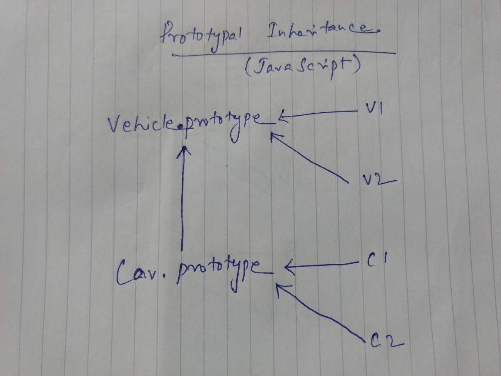
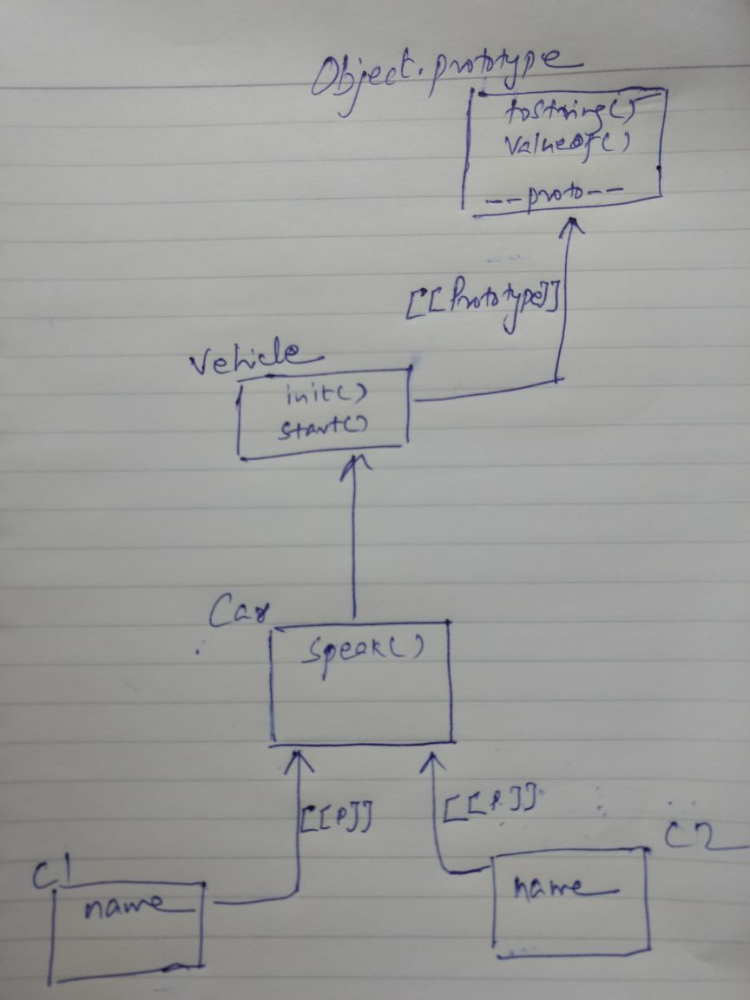

# Inheritance
Inheritance in most class-based object-oriented languages is a mechanism in which one object acquires all the properties and behaviours of the parent objec.

## Classical Inheritance (Non JavaScript)


 Diagram of Classical Inheritance
  * Vehicle is parent class and v1,v2 are the instances of Vehicle
  * Car is child class of Vehicle and c1, c2 are instances of Car
  * In classical inheritance it creates a copy of class when we create an instance or object and after that class and instance both are separate entity.
  
## Prototypal Inheritance (Behvaiour Delegation pattern)


Diagram of Prototypal Inheritance
  * v1 and v2  is linked to Vehicle.prototype because it’s been created using new keyword.
  * c1 and c2 is linked to Car.prototype and Car.prototype is linked to Vehicle.prototype.
  * In JavaScript when we create the object it does not copy the property of constructor it creates a link

```
function Vehicle(name) {
  this.name = name;
}

Vehicle.prototype.start = function() {
  return "engine of "+this.name + " starting...";
};

function Car(name) {
  Vehicle.call(this,name);
}

Car.prototype = Object.create(Vehicle.prototype);

Car.prototype.speak = function() {
  console.log("Hello "+ this.start());
};

var c1 = new Car("Fiesta");
var c2 = new Car("Baleno");

c1.speak(); // "Hello engine of Fiesta starting..."
c2.speak(); // "Hello engine of Baleno starting..."

// var c1 = Object.create(Car.prototype);
// Car.call(c1,'Fiesta');
// c1.speak();
```
### same above functionality can be achived without prototype, without constructor and without new keyword
```
function Vehicle(name) {
  this.name = name;
}

Vehicle.prototype.start = function() {
  return "engine of "+this.name + " starting...";
};


var Car = Object.create(Vehicle.prototype);
Car.init = function() {
  Vehicle.call(this,name);
}

Car.speak = function() {
  console.log("Hello "+ this.start());
};

var c1 = Object.create(Car);
c1.init('Fiesta');
c1.speak();
```
### Same Prototype chain functionality (Prototypal Inheritance) can be achieved with Linking Object to Other Object.
This pattern is called Object Delegation pattern.
```
var Vehicle= {
  init: function(name) {
    this.name = name; 
  },
  start: function() {
    return "engine of "+this.name + " starting...";
  }
}

var Car = Object.create(Vehicle);

Car.speak = function() {
  console.log("Hello "+ this.start());
};

var c1 = Object.create(Car);
c1.init('Fiesta');
var c2 = Object.create(Car);
c2.init('Baleno');

c1.speak();
c2.speak();
```
Diagram to represnt above code (Linking Object to Other Object)


