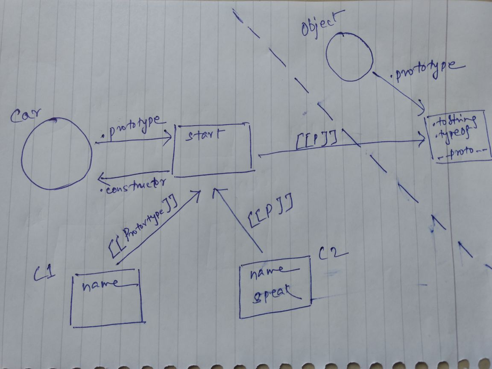

# Prototype
A Prototype is an object that exists on every function in Javascript.Prototype property is just an empty object.
Objects does not have prototype property. It has __proto__ property.
```
var bikeFunc = function(){
}
console.log(bikeFunc.prototype);

var bike = {name: 'ninja'}
console.log(bike.__proto__);
```

* Every single **_object_** is built by a constructor function.
* When we call a function with **_new_** keyword it creates a brand new object.
* Each time a constructor is called, a new object is created be it calling directly or indirectly the constructor
* A constructor makes an object linked to its own prototype.

## Prototype (.prototype, [[Protoytype]], \_\_proto\_\_)
```
function Car(name) {
  this.name = name;
}

Car.prototype.start = function() {
  return "engine of "+this.name + " starting...";
};

var c1 = new Car("Santa Fe");
var c2 = new Car("Fiesta");

c2.speak = function() {
  console.log("Hello, " + this.start());
};

c2.speak();

console.log(c1.constructor === Car);
console.log(c1.constructor === c2.constructor);
console.log(c1.__proto__ === Car.prototype);
console.log(c1.__proto__ === c2.__proto__);

console.log(c1.__proto__ === Object.getPrototypeOf(c1));
console.log(c2.__proto__ === c2.constructor.prototype);

```
We will go through below diagram to understand the prototype in above code snippet

  * Function and Object linked with an arbitrary linkage called .prototype
  * [[Prototype]] is an internal linkage which get created after executing any function with “new” keyword
  * \_\_proto\_\_ is an public property of Object.prototype to access the [[Prototype]] linkage
  * Object.getPrototypeOf() is a method to access the \_\_proto\_\_


## Property Shadowing
Property or method shadowing is possible but best practise is to avoid it.
```
function Car(name) {
  this.name = name;
}

Car.prototype.start = function() {
  return "engine of "+this.name + " starting...";
};

var c1 = new Car("Fiesta");
console.log(c1.start());      //"engine of Fiesta starting..." 

c1.start = function() {
  console.log("Hello " + Car.prototype.start.call(this));
};

c1.start();      //"Hello engine of Fiesta starting..."
```
## Object Linking
We can link Objects to achieve parent class and child class kind of scenario.
```
function Vehicle(name) {
  this.name = name;
}

Vehicle.prototype.start = function() {
  return "engine of "+this.name + " starting...";
};

function Car(name) {
  Vehicle.call(this,name);
}

Car.prototype = Object.create(Vehicle.prototype);

Car.prototype.speak = function() {
  console.log("Hello "+ this.start());
};

var c1 = new Car("Fiesta");
var c2 = new Car("Baleno");

c1.speak(); // "Hello engine of Fiesta starting..."
c2.speak(); // "Hello engine of Baleno starting..."
```
### Summary
  * Constructor: It’s a function which called with new keyword in front of it but .constructor is a property
  * [[Prototype]] is a linkage from one object to another object, it creates when we call Object.create() or when we call a function with new keyword
  * \_\_proto\_\_ or Object.getPrototypeOf or .constructor.prototype all points to [[Prototype]]

